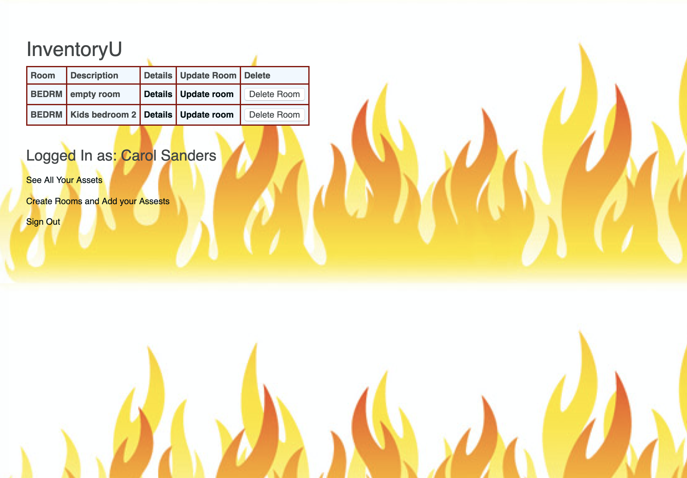

#InventoryU:
**Descripton**
InventoryU is your resource for documenting and retrieving all your personal assets. Born out of necessity, residents face hurdles when placing claims to their insurance companies for reembursement of lost assets. InveentoryU will allow you to create a room and add assets or items in your room. You can also delete rooms and items from your room.

☐ Screenshot(s): Images of your actual game.
  
  
  
  

☐ Technologies Used: 
  1. HTML 
  2. CSS 
  3. MongoDB 
  4. Mongoose 
  5. JavaScript 
  6. Express

☐ Getting Started: 
  [InventoryU](https://inventoryu.herokuapp.com/)
Log in with your favorite Google account to get started.

☐ Next Steps: Planned future enhancements (icebox items).